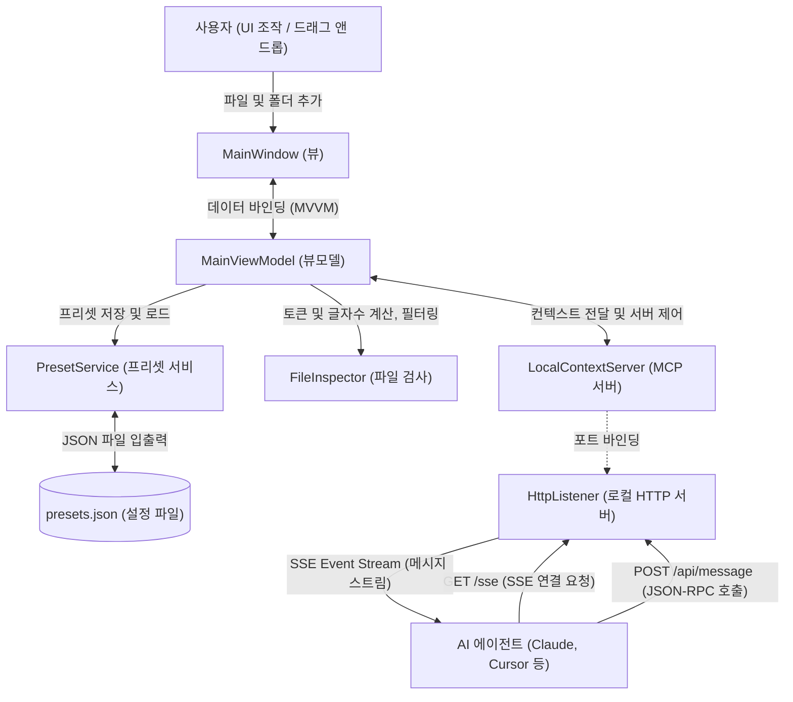

# MCP Context Feeder

MCP Context Feeder는 외부 AI 에이전트(Claude, Cursor 등)에게 다수의 참조 문서와 폴더 컨텍스트를 빠르고 효율적으로 주입하기 위해 개발된 로컬 유틸리티입니다. 
Model Context Protocol(MCP) 표준을 준수하며, 에이전트가 단 한 번의 도구 호출로 지정된 작업 목표와 필요한 코드/문서 컨텍스트를 모두 가져갈 수 있도록 지원합니다.

## 주요 기능

* **직관적인 컨텍스트 구성**: 드래그 앤 드롭 및 다중 선택(Ctrl/Shift+Click)을 통해 참조할 파일과 폴더를 쉽게 목록화할 수 있습니다.
* **실시간 토큰 예측**: 등록된 파일들의 텍스트 용량을 실시간으로 분석하여 대략적인 토큰 수와 글자 수를 제공합니다.
* **로컬 MCP 서버 내장**: SSE(Server-Sent Events) 및 JSON-RPC 기반의 표준 MCP 서버가 내장되어 별도의 복잡한 설정 없이 에이전트와 통신할 수 있습니다.
* **단일 컨텍스트 주입 도구**: `get_reference_context` 도구를 통해 현재 등록된 참조 문서의 본문 전체와 사용자의 작업 목표(Task Intent)를 에이전트에게 한 번에 전달합니다.

## 사용 방법

1. 애플리케이션을 실행합니다.
2. AI에게 참조시킬 문서나 코드 폴더를 앱 화면에 드래그 앤 드롭하여 추가합니다.
3. 에이전트에게 지시할 작업 목표를 작성합니다.
4. **서버 시작** 버튼을 눌러 로컬 MCP 서버를 가동합니다. (포트 충돌 시 자동으로 다음 사용 가능한 포트를 할당하며, 주소는 화면에 표시됩니다. 예: `http://127.0.0.1:15050/sse`)
5. 사용 중인 AI 에이전트(예: Claude Desktop)의 설정 파일에 위 SSE 엔드포인트를 MCP 서버로 등록합니다.
6. 에이전트에게 작업을 요청하면, 에이전트가 자동으로 `get_reference_context` 도구를 호출하여 컨텍스트를 획득합니다.

## 설계적 배경 및 AI 에이전트 활용 팁

본 도구는 에이전트가 프로젝트를 무작위로 탐색하며 발생하는 **불필요한 API 호출(탐색 오버헤드)을 원천 차단**하고, 가장 최적화된 경로로 작업을 완수하도록 아래와 같이 설계되었습니다.

* **읽기/쓰기 분리(CQRS) 아키텍처**:
  * 본 피더(Feeder)는 오직 안전한 **'무상태(Stateless) 읽기 스냅샷 제공'**에만 집중합니다.
  * 추론이 끝난 결과의 수정 및 최신화(Write-back) 작업은 AI 에이전트가 자체 파일 수정 도구(Write Tool)를 활용해 지식 베이스를 자율 갱신하도록 역할을 명확히 격리했습니다. 이로 인해 불필요한 프로세스 락(Lock) 충돌이나 데이터 경합이 방지됩니다.
* **절대 경로 매핑을 통한 Zero-search Write**:
  * 에이전트에게 컨텍스트를 전달할 때 단순 텍스트가 아닌 실제 파일의 절대 경로(`FilePath`)를 메타데이터로 함께 제공합니다.
  * 에이전트는 코드를 수정한 후, 파일의 위치를 찾기 위해 다시 온 디렉토리를 탐색하는 API 호출을 거치지 않고 **전달받은 절대 경로에 즉시 쓰기를 수행**할 수 있어 극단적인 시간 및 토큰 절감 효과를 냅니다.
* **옵시디언(Obsidian) 지식 베이스 연동 추천**:
  * 본 도구를 개인 지식 보관소(Obsidian Vault 등)에 직접 연결하여 사용하시는 것을 추천합니다. 에이전트가 공급받은 무상태 스냅샷을 읽어 분석한 뒤, 에이전트 전용의 파일 쓰기 도구를 활용해 지식 문서를 자율 갱신(Write-back)하도록 구성하면 안전하고 직관적인 '양방향 지식 진화 루프'를 쉽게 완성할 수 있습니다.

## 기술 스택 및 아키텍처

* **Language/Framework**: C# / .NET 8.0 / WPF
* **Architecture**: MVVM 아키텍처 패턴 (`CommunityToolkit.Mvvm` 소스 제너레이터 활용)
* **Dependency Injection**: `Microsoft.Extensions.DependencyInjection`
* **Protocol**: Model Context Protocol (MCP) 표준 호환 (SSE & JSON-RPC 2.0 로컬 서버 직접 구현)

## 아키텍처 및 데이터 흐름

### 1. 시스템 구성도

### 2. 핵심 아키텍처 특징

* **MVVM & DI (의존성 주입)**: `Microsoft.Extensions.DependencyInjection`을 사용하여 뷰(`MainWindow`), 뷰모델(`MainViewModel`), 비즈니스 서비스(`PresetService`, `FileInspector`) 간의 결합도를 낮추고 유지보수성을 높였습니다.
* **비동기 토큰 계산**: 대량의 폴더/파일을 분석할 때 UI가 굳지 않도록 `CancellationTokenSource` 기반의 비동기 태스크(`Task.Run`)로 글자 수 및 대략적인 토큰 수(글자수 / 3)를 실시간 예측합니다.
* **로컬 MCP SSE 서버**: `HttpListener`를 기반으로 JSON-RPC 2.0 프로토콜과 SSE(Server-Sent Events) 스트림을 직접 구현하여, 에이전트의 다양한 요청을 이벤트 기반으로 안전하게 동기화합니다.
* **CQRS (명령 및 조회 책임 분리)**: 본 피더는 **무상태(Stateless) 읽기 스냅샷 제공**에만 집중하며, 수정 내역의 반영은 에이전트가 자체 파일 수정 도구(Write Tool)를 통해 절대 경로로 직접 수행하여 충돌을 차단합니다.

## 라이선스

이 프로젝트는 MIT 라이선스에 따라 라이선스가 부여됩니다. 자세한 내용은 [LICENSE](file:///c:/Users/adg01/Documents/GitHub/mcp-context-gate/LICENSE) 파일을 참조하십시오.
